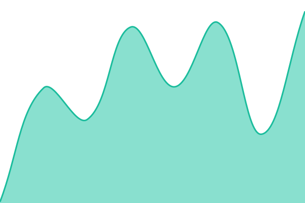
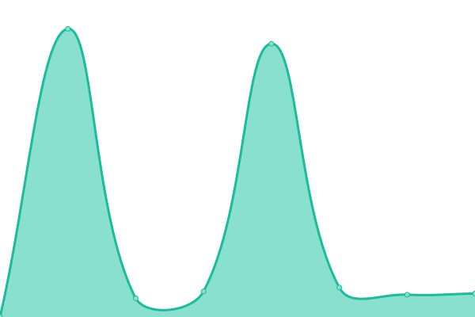
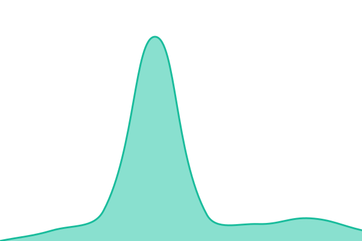

# [📈 Live Status](https://status.recaptime.eu.org): <!--live status--> **🟧 Partial outage**

This repository contains the open-source uptime monitor and status page for [Recap Time Squad](https://recaptime.eu.org), powered by [Upptime](https://github.com/upptime/upptime).

With [Upptime](https://upptime.js.org), you can get your own unlimited and free uptime monitor and status page, powered entirely by a GitHub repository. We use [Issues](https://github.com/RecapTime/infra-monitoring/issues) as incident reports, [Actions](https://github.com/RecapTime/infra-monitoring/actions) as uptime monitors, and [Pages](https://status.recaptime.eu.org) for the status page.

<!--start: status pages-->
<!-- This summary is generated by Upptime (https://github.com/upptime/upptime) -->
<!-- Do not edit this manually, your changes will be overwritten -->
<!-- prettier-ignore -->
| URL | Status | History | Response Time | Uptime |
| --- | ------ | ------- | ------------- | ------ |
|  [RecapTime.dev homepage](https://recaptime.dev) | 🟩 Up | [recap-time-dev-homepage.yml](https://github.com/recaptime-dev/infra-monitoring/commits/HEAD/history/recap-time-dev-homepage.yml) | 

 120ms
     
 | 

<a href="https://status.recaptime.dev/history/recap-time-dev-homepage">100.00%</a>
    

|  [Vaultwarden](https://vault.recaptime.dev/alive) | 🟥 Down | [vaultwarden.yml](https://github.com/recaptime-dev/infra-monitoring/commits/HEAD/history/vaultwarden.yml) | 

 0ms
     
 | 

<a href="https://status.recaptime.dev/history/vaultwarden">0.00%</a>
    

|  [golinks](https://go.recaptime.dev/ping) | 🟩 Up | [golinks.yml](https://github.com/recaptime-dev/infra-monitoring/commits/HEAD/history/golinks.yml) | 

 435ms
     
 | 

<a href="https://status.recaptime.dev/history/golinks">100.00%</a>
    

|  [Org wiki](https://hq.recaptime.dev/w/api.php?action=help&format=json&errorformat=wikitext&wrap=1&formatversion=2) | 🟩 Up | [miraheze.yml](https://github.com/recaptime-dev/infra-monitoring/commits/HEAD/history/miraheze.yml) | 

 936ms
     
 | 

<a href="https://status.recaptime.dev/history/miraheze">100.00%</a>
    

|  [Phroge](https://issues.recaptime.dev) | 🟥 Down | [phorge.yml](https://github.com/recaptime-dev/infra-monitoring/commits/HEAD/history/phorge.yml) | 

 31ms
     
 | 

<a href="https://status.recaptime.dev/history/phorge">0.00%</a>
    

|  [Static CDN for our websites](https://static.rtdevcdn.net.eu.org/ping) | 🟩 Up | [static-cdn.yml](https://github.com/recaptime-dev/infra-monitoring/commits/HEAD/history/static-cdn.yml) | 

 466ms
     
 | 

<a href="https://status.recaptime.dev/history/static-cdn">100.00%</a>
    

|  [Static CDN for Third Party brand icons](https://thirdparty.brandkit.rtdevcdn.net.eu.org) | 🟩 Up | [3pbrandkit-cdn.yml](https://github.com/recaptime-dev/infra-monitoring/commits/HEAD/history/3pbrandkit-cdn.yml) | 

 988ms
     
 | 

<a href="https://status.recaptime.dev/history/3pbrandkit-cdn">100.00%</a>
    

<!--end: status pages-->

[**Visit our status website**](https://status.recaptime.eu.org) to see the graphs interactively, or [**see also statuses of third-party services we use at our Instatus page**](https://recaptimesquad.instatus.com).

## 📄 License

- Powered by: [Upptime](https://github.com/upptime/upptime)
- Code: [MIT](./LICENSE) © [Recap Time Squad](https://recaptime.eu.org)
- Data in the `./history` directory: [Open Database License](https://opendatacommons.org/licenses/odbl/1-0/)
